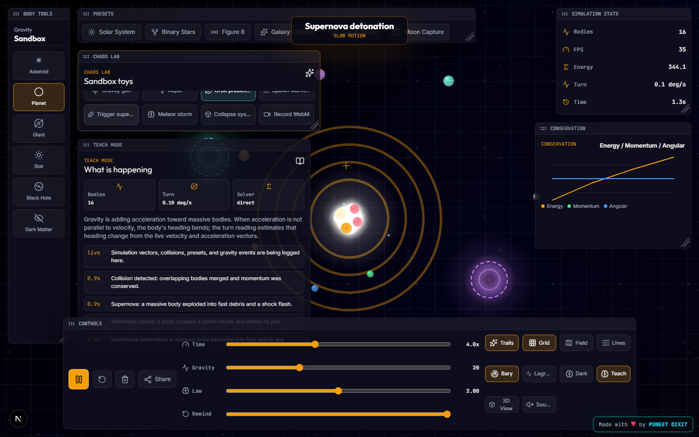
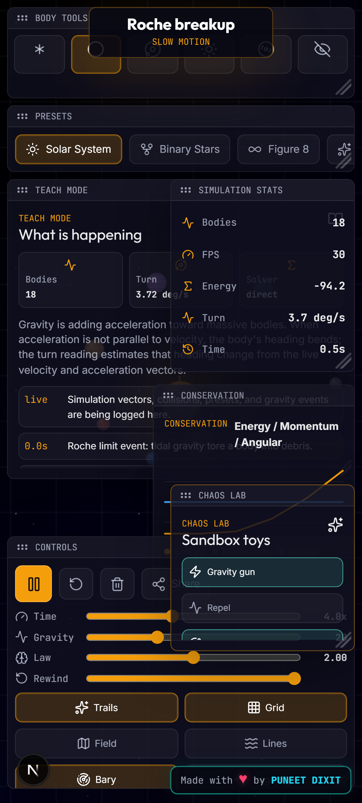

# Feature Guide

## Core Sandbox

- Full-viewport space canvas with a starfield and distorted grid.
- Body placement by click or drag. Drag direction and length become the new body's launch velocity.
- Body selection opens a movable info panel with mass, velocity, and acceleration data.
- Solar System loads by default.

## Body Types

- Asteroid: tiny low-mass body for impacts and dense fields.
- Planet: medium body with colored trails.
- Giant: heavier body with banded rendering and thicker trails.
- Star: bright glowing body that dominates local gravity.
- Black hole: high-mass absorber with accretion disk and lensing rings.
- Dark matter: hidden mass source that attracts bodies without normal collision behavior.

## Physics

- N-body gravitational acceleration with a softening parameter.
- Velocity Verlet integration for stable orbital behavior.
- Momentum-conserving collision merges.
- Black hole event-horizon absorption.
- Roche-limit breakup into debris.
- Dense-scene optimization using direct, hybrid, and Barnes-Hut style solver modes.
- Live total energy, momentum, angular momentum, and turn-rate dashboards.

## Chaos Lab

The Chaos Lab panel adds the higher-fun tools:

- Gravity gun: hold on the canvas to pull bodies toward the cursor.
- Repel: flips the gravity gun into a push tool.
- Orbit prediction: draws dashed future path previews for important bodies.
- Spawn wormholes: opens a linked portal pair. Bodies entering one mouth exit from the other.
- Trigger supernova: detonates a massive body into debris and pushes nearby bodies outward.
- Meteor storm: spawns fast asteroids from the viewport edges.
- Collapse system: creates a black hole at the barycenter and nudges bodies inward.
- Record WebM: captures a short replay from the canvas.

## Teach Mode

Teach mode is on by default. It explains the active physics and logs simulation events such as body placement, preset loads, collisions, black hole absorption, Roche breakup, wormhole transit, and supernova detonation.

## Visual Modes

- 2D mode: direct top-down simulation view.
- 3D mode: projected perspective grid and depth-scaled bodies.
- Trails, grid, heatmap, field lines, barycenter, Lagrange markers, dark matter visibility, and sound are toggleable from the controls panel.
